<p align="center">
  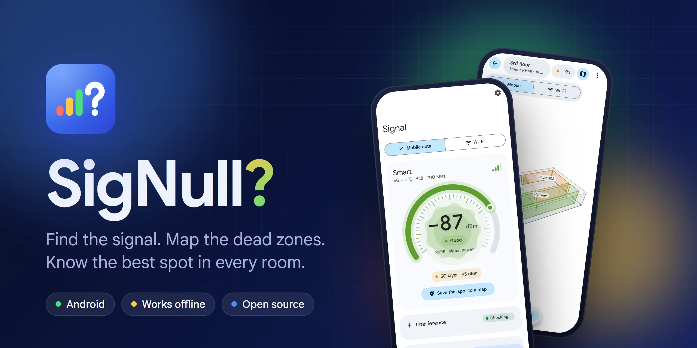
</p>

<p align="center">
  <a href="https://github.com/jherobred/SigNull/actions/workflows/ci.yml"></a>
  <a href="https://github.com/jherobred/SigNull/releases/latest"></a>
  <a href="LICENSE"></a>
  
</p>

# SigNull?

**Find the signal. Map the dead zones.** An Android app that shows your exact mobile and Wi‑Fi signal strength, tells you how to hold your phone for the strongest signal, and builds a room-by-room signal map as you explore. It works offline.

<p align="center">
  <a href="docs/media/signull.mp4"></a>
  <br>
  <sub><a href="docs/media/signull.mp4">Watch the 45-second video</a></sub>
</p>

<p>
  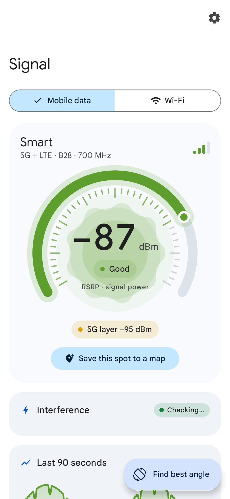
  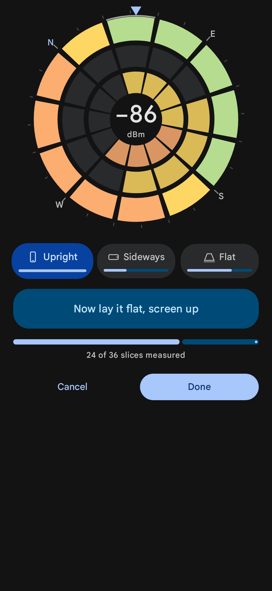
  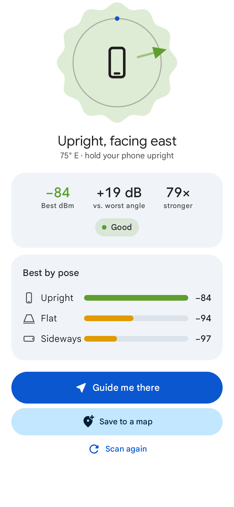
  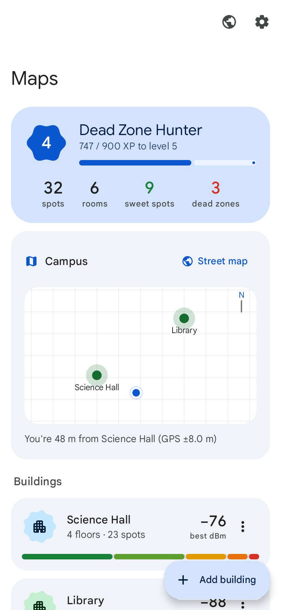
  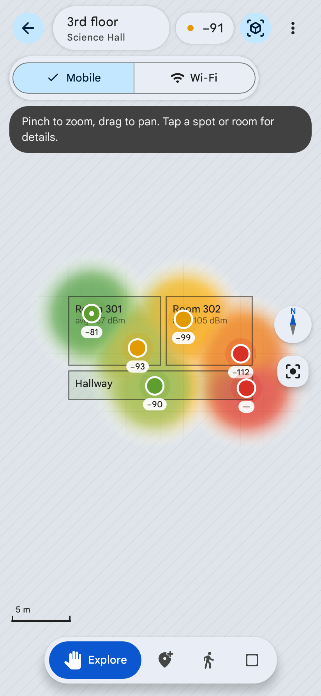
</p>
<p>
  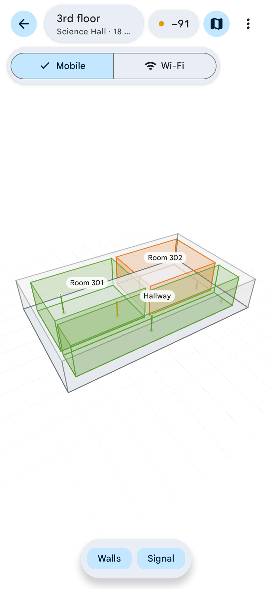
  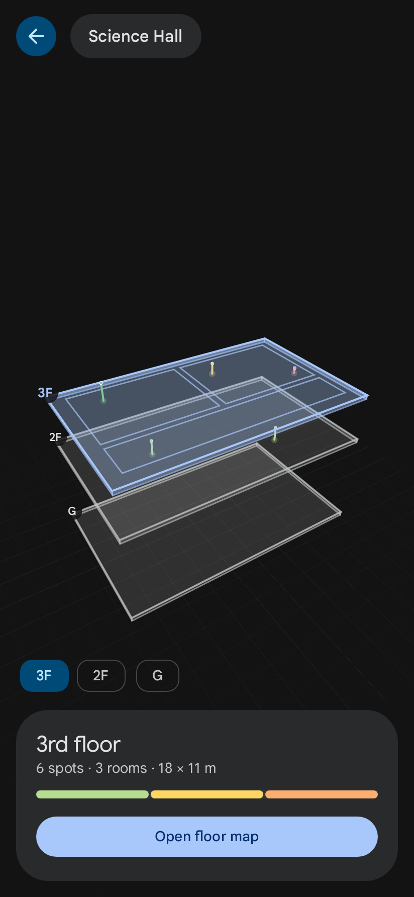
  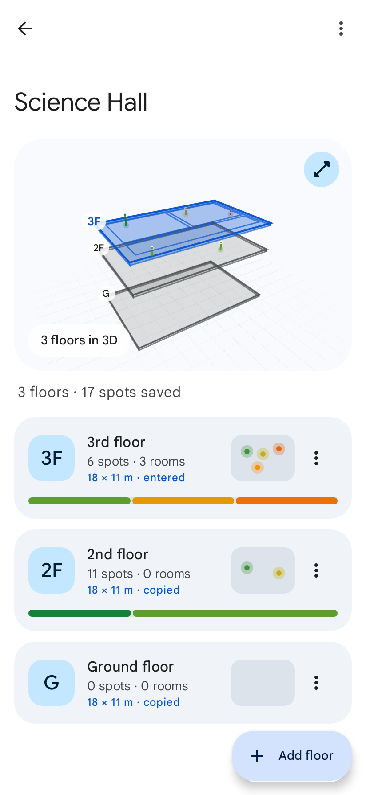
  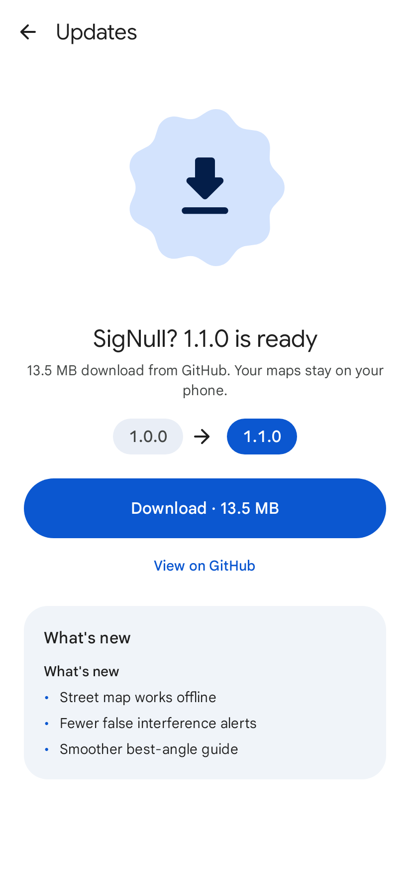
  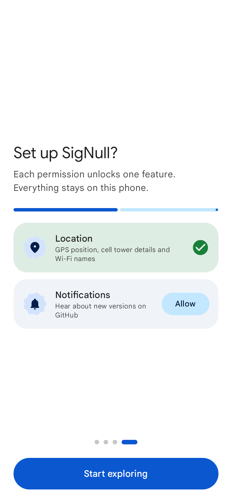
</p>


Signal changes from room to room and even with how you hold your phone. When your laptop runs on your phone's hotspot, a few dB decide whether a video call works. SigNull? replaces guesswork with numbers.


- **Exact signal.** Live RSRP, RSRQ, SINR and RSSI for 4G/5G (RSCP for 3G, RSSI for 2G) from the SIM that carries mobile data, plus Wi‑Fi RSSI, band, channel and link speed. Shows the serving band, cell PCI and approximate tower distance when Android exposes them.
- **Best angle finder.** Turn around once while holding the phone upright, flat and sideways. SigNull? bins readings by compass direction and pose, picks the strongest one, then guides you back to it with live "turn right 40°" prompts and haptics.
- **Interference alerts.** Flags a strong but noisy cell signal (good RSRP with poor SINR or RSRQ), crowded Wi‑Fi channels, signal that swings or drops out while you stand still, and magnetic fields that throw off the compass. Saved spots remember the interference seen when they were measured.
- **Signal maps, starting blank.** Add buildings, floors and rooms. Each saved spot (a 5‑second averaged reading) lifts the fog of war and feeds a heatmap. Dead zones and sweet spots count toward your explorer rank.
- **Floor size copied to every floor.** Type a floor's width and length once and every other floor of the building gets the same outline. Floors you sized yourself keep their own.
- **Floors and buildings in 3D.** Orbit a model of a floor or a whole building with your signal readings standing on it.
- **Street map.** Buildings, 3D footprints colored by signal, and GPS-tagged readings on a real map with streets and places. Save an area for offline use.
- **Updates from GitHub.** SigNull? checks this repository's releases, downloads the new APK and installs it after verifying it was signed with the same key.
- **Indoor position.** GPS places buildings on the map. Inside, Walk mode counts your steps and uses the compass to move your dot across the floor map.
- **Private.** No account, no analytics and no cloud backup. Your maps stay in a local database on the phone, and a new install always starts blank.
- **Material 3.** Dynamic color, Google Sans, spring-based motion throughout, light and dark themes.

## Network use

Signal measuring, maps and the angle finder work without internet. SigNull? connects only to:

| Host | Why | How to avoid it |
| --- | --- | --- |
| `tiles.openfreemap.org` | Street map tiles | Don't open the street map, or save an area for offline use while connected |
| `api.github.com`, `github.com` | Checking for and downloading updates | Turn off **Settings › Check automatically** |


| Piece | Implementation |
| --- | --- |
| Cellular signal | `TelephonyCallback.SignalStrengthsListener` plus `requestCellInfoUpdate` polling every 1.5 s for fresher serving-cell readings ([`CellularMonitor`](app/src/main/java/app/signull/core/signal/CellularMonitor.kt)) |
| Wi‑Fi signal | Connected RSSI polled every second, nearby access points from scans ([`WifiMonitor`](app/src/main/java/app/signull/core/signal/WifiMonitor.kt)) |
| Interference | Rules over the last 20 seconds of readings, nearby access points and the magnetometer ([`Interference.kt`](app/src/main/java/app/signull/core/signal/Interference.kt)) |
| Orientation | Rotation-vector sensor, with accelerometer + magnetometer fallback for phones without a gyroscope ([`OrientationTracker`](app/src/main/java/app/signull/core/sensors/OrientationTracker.kt)) |
| Best angle | 12 compass sectors × 3 poses, median per cell, neighbor smoothing so one lucky sample can't win ([`Sweep.kt`](app/src/main/java/app/signull/core/angle/Sweep.kt)) |
| 3D view | A small Canvas renderer with an orbit camera and depth-sorted faces, so no 3D engine is bundled ([`Model3DView`](app/src/main/java/app/signull/ui/model3d/Model3DView.kt)) |
| Street map | MapLibre with OpenFreeMap vector tiles. Floor outlines are turned into GPS footprints around each building's pin ([`GeoPlacement`](app/src/main/java/app/signull/core/map/GeoPlacement.kt)) |
| Heatmap | Inverse-distance weighting that fades out away from measured spots ([`Heatmap.kt`](app/src/main/java/app/signull/core/map/Heatmap.kt)) |
| Walk mode | Peak detection on acceleration magnitude, no activity permission needed ([`StepDetector`](app/src/main/java/app/signull/core/sensors/StepDetector.kt)) |
| Updates | GitHub Releases API, WorkManager check every 12 hours, `PackageInstaller` session ([`Updater`](app/src/main/java/app/signull/update/Updater.kt)) |
| Storage | Room database: buildings → floors → rooms and spots → readings. Backup is turned off, so a reinstall never brings old data back |

## Limitations

- **Android only.** iOS does not let apps read cellular or Wi‑Fi signal strength.
- Android reports cellular signal every one to a few seconds, so the angle finder asks you to turn slowly.
- Compasses drift near steel and electronics. If the app asks, wave the phone in a figure 8.
- While your hotspot is on, most phones turn off Wi‑Fi scanning, so measure Wi‑Fi separately.
- Step counting is approximate. Drag your dot to correct drift.

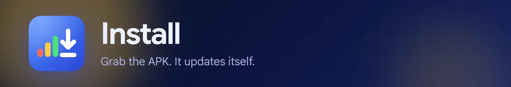

Download `SigNull-vX.Y.Z.apk` from the [latest release](https://github.com/jherobred/SigNull/releases/latest) and open it on your phone. Android asks you to allow installs from your browser or file manager the first time. After that, SigNull? updates itself from new releases.

Android only installs an update signed with the same key as the installed app. If you installed a build from CI, from Android Studio, or one you built yourself, uninstall it once before installing a release. Uninstalling deletes your saved maps.

## Build

Requirements: JDK 17+ and the Android SDK with **Platform 37.2** (Android Studio installs it on first sync).

```bash
./gradlew assembleRelease
```

The APK lands in `app/build/outputs/apk/release/`. Without a release key it is signed with your debug key. To sign with your own key, add these to `~/.gradle/gradle.properties`:

```properties
signull.keystore=/path/to/release.jks
signull.storePassword=...
signull.keyAlias=...
signull.keyPassword=...
```

## Tests

```bash
./gradlew testDebugUnitTest
```

Screenshot tests render every screen on the JVM with Robolectric and Roborazzi. After UI changes, re-record them:

```bash
./gradlew recordRoborazziDebug
```


See [CONTRIBUTING.md](CONTRIBUTING.md). Good first areas: carrier band tables, more languages, floor-plan photo backgrounds, and export/import of maps.

## License

Apache License 2.0. See [LICENSE](LICENSE).

The bundled Google Sans font is licensed under the SIL Open Font License 1.1 ([third_party/google-sans/OFL.txt](third_party/google-sans/OFL.txt)). SigNull? is not affiliated with Google.

Map tiles by [OpenFreeMap](https://openfreemap.org). Map data © [OpenStreetMap](https://www.openstreetmap.org/copyright) contributors.
